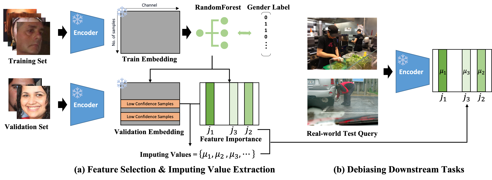

# Unified-Debiaisng-VLM-SFID
An official repository for "A Unified Debiasing Approach for Vision-Language Models across Modalities and Tasks"


## Method



## Data Preparation
- FairFace dataset for debiasing embeddings with image inputs: [Link](https://github.com/joojs/fairface)
- FACET dataset for zero-shot classification: [Link](https://ai.meta.com/datasets/facet/)
- Flickr30K dataset for text-to-image retrieval: [Link](https://shannon.cs.illinois.edu/DenotationGraph/)
- COCO2014 caption dataset for image captioning: [Link](https://cocodataset.org/#download)
- Bias-in-bios dataset is included in the script with ```dataset``` package.
- Profession list for text-to-image generation is included in ```external/codi``` directory.

## Install packages and prepare the pretrained checkpoint
Run
```sh install_packages.sh```

## Data Preprocessing and extracting embeddings
Run
```sh embedding_preprocessing.sh```

## Run debiasing and evaluation
### Hyperparmeters
- ```--target```: a list of component to debias. List ```image``` and ```text``` for encoder-only structure (zero-shot classification, text-to-image retrieval), and ```encoder``` and ```decoder``` for generative model (image captioning, text-to-image generaion).
- ```--t```: a confidence threshold to select low confidence sample.
- ```--{COMPONENT}_prune_num```: the number of features to be pruned for each component. ```50``` to ```100``` is recommended.
- ```--mode```: use ```--mode sfid``` for using SFID. Use any other text for the baseline code without debiasing. (e.g., ```--mode base```)
### Run
#### Zero-Shot Classification and Text-to-Image Retrieval
```python src/run_zc_retrieval.py --target image text --base ViT-B/32 --mode sfid --image_prune_num 50 --text_prune_num 50 --t 0.7```   
```python src/run_zc_retrieval.py --target image text --base RN50 --mode sfid --image_prune_num 50 --text_prune_num 50 --t 0.7```   
#### Image Captioning
``` python src/run_clip_cap.py --target decoder --mode sfid  --decoder_prune_num 50 --t 0.9```    
``` python src/run_blip.py --target decoder --mode sfid  --decoder_prune_num 50 --t 0.9```   
#### Text-to-Image Generation
```python src/run_sd.py --target decoder --mode sfid --decoder_num 50 --t 0.5```    
```python src/run_codi.py --target decoder --mode sfid --decoder_num 50 --t 0.5```

